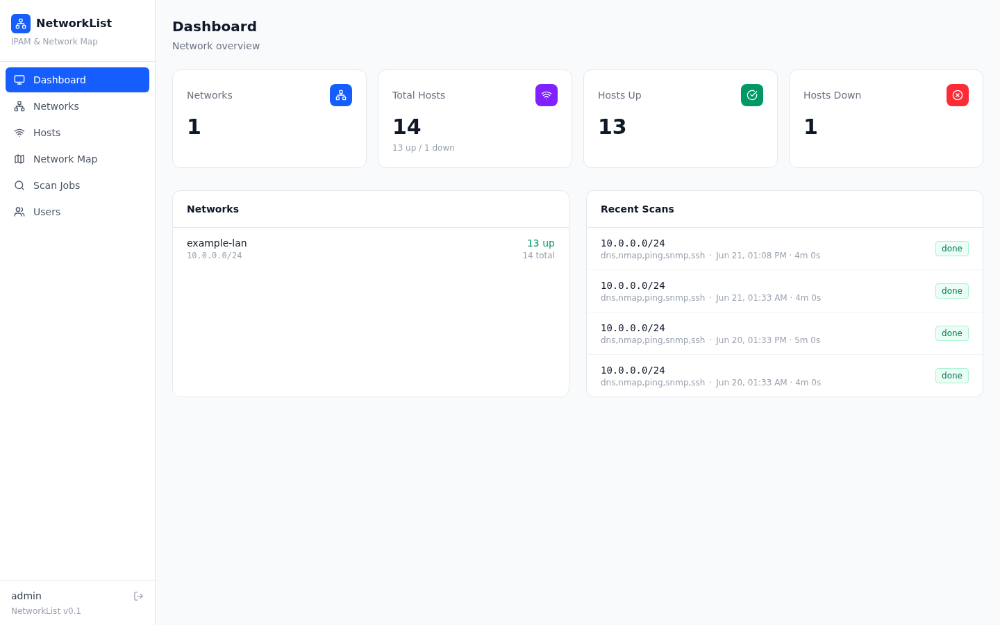
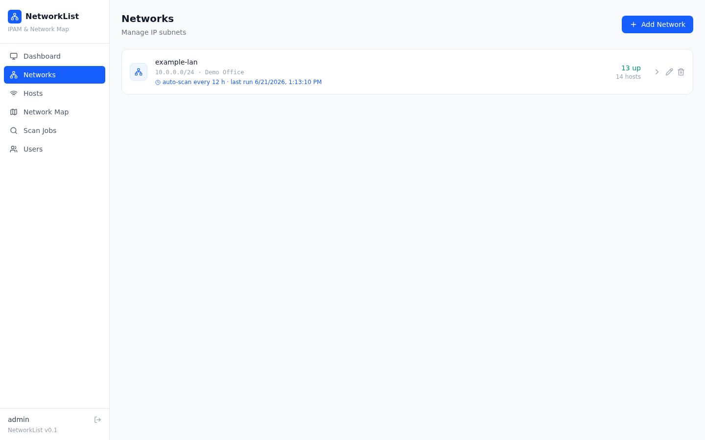
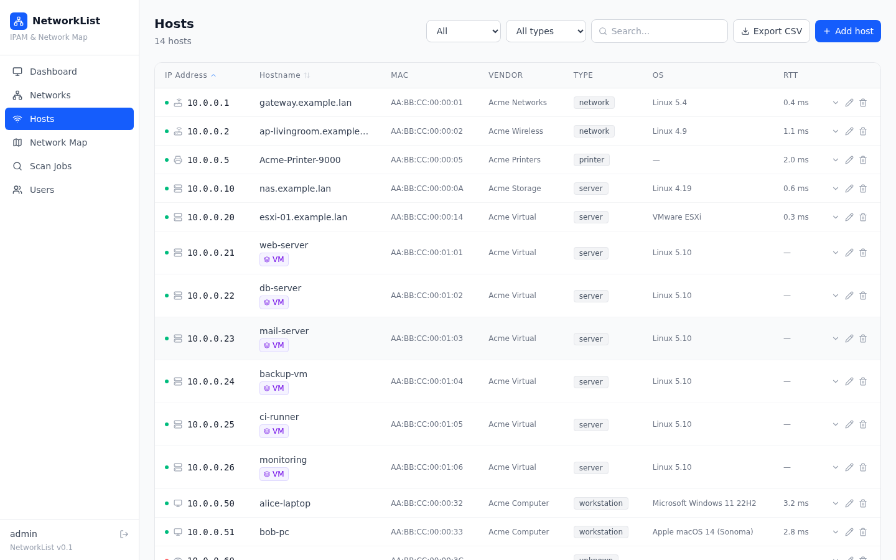
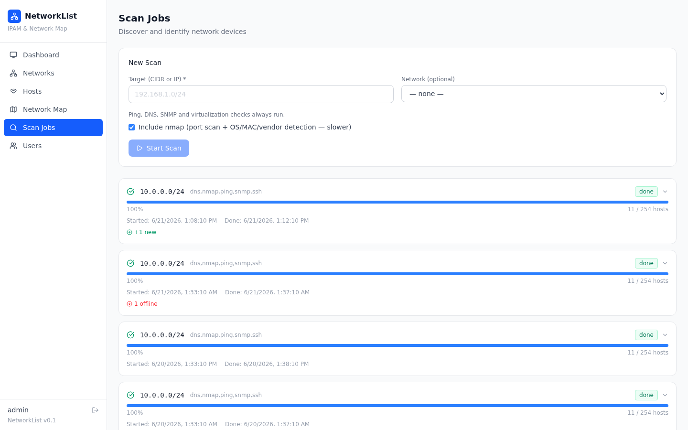
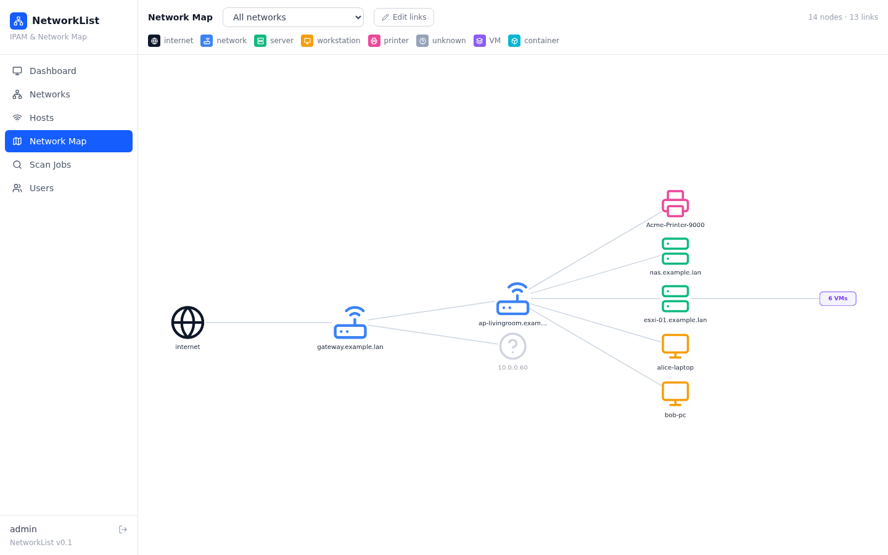
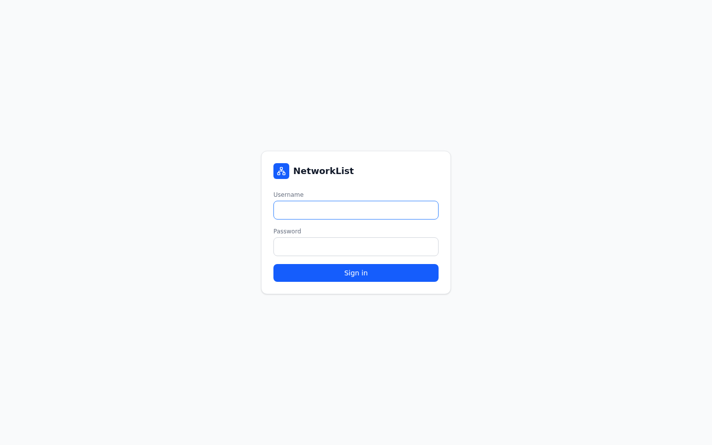
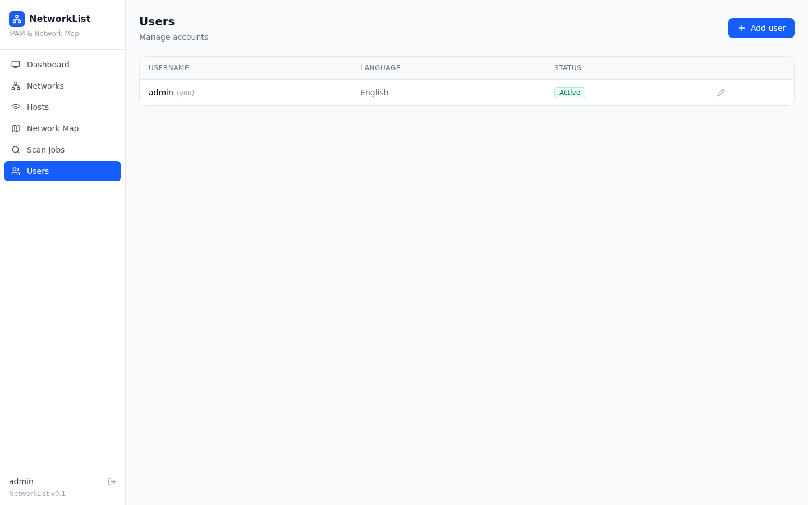

# NetworkList

IPAM (IP address management) and network topology visualization for a home or small office LAN. Scans the network, identifies devices, and builds an interactive map — no need to maintain spreadsheets or draw diagrams by hand.

## Table of contents

- [Goals](#goals)
- [Features](#features)
  - [Dashboard — the big picture](#dashboard--the-big-picture)
  - [Networks — subnet inventory](#networks--subnet-inventory)
  - [Hosts — full inventory](#hosts--full-inventory)
  - [Scan Jobs — running and history](#scan-jobs--running-and-history)
  - [Network Map — interactive network map](#network-map--interactive-network-map)
  - [Login and users](#login-and-users)
- [Tech stack](#tech-stack)
- [Deploying on a clean Debian 13 machine](#deploying-on-a-clean-debian-13-machine)
  - [1. System packages](#1-system-packages)
  - [2. Passwordless nmap](#2-passwordless-nmap)
  - [3. Get the code](#3-get-the-code)
  - [4. Backend](#4-backend)
  - [5. Frontend](#5-frontend)
  - [6. Run it](#6-run-it)
  - [7. (optional) Auto-start and resilience across reboots](#7-optional-auto-start-and-resilience-across-reboots)
  - [Verify](#verify)
- [Deploying via Docker Compose](#deploying-via-docker-compose)
  - [1. Prepare the files](#1-prepare-the-files)
  - [2. Run it](#2-run-it)
    - [Scanning from the host network (MAC/vendor, L2 adjacency)](#scanning-from-the-host-network-macvendor-l2-adjacency)
  - [3. Updating](#3-updating)

## Goals

- **A single source of truth for the network**: what devices exist, their IP/MAC/name/vendor/OS/open ports, and status (online/offline).
- **Automatic discovery** instead of manual inventory: ping/ARP liveness checks, reverse DNS, nmap (ports, OS, MAC vendor), SNMP (sysName/sysDescr), plus separate polling of virtualization platforms (vCenter, Docker, Hyper-V, ESXi, Proxmox) for nested VMs/containers.
- **A clear network map** instead of a static Visio/Draw.io diagram: a horizontal tree, automatically rebuilt on every scan.
- **Manual control where automation gets it wrong**: manually add devices that don't respond to scanning, lock auto-overwritten names, draw manual links between devices, hide noise (powered-off VM templates, uninteresting entities) from the map.
- **Audit history**: a log per scan and per host — exactly what succeeded or failed on a given check.

## Features

### Dashboard — the big picture
A summary of networks and hosts (total/online/offline), and a list of recent scans with progress.



### Networks — subnet inventory
CRUD for IP subnets: CIDR, name, VLAN, gateway, site, description. Each network shows host count and how many are online. Each network can have automatic periodic rescanning enabled, on any interval (minutes, hours, or days), with a separate toggle for whether the slow nmap stage is included in the auto-scan.



### Hosts — full inventory
A table of every discovered device with filters (by status, by device type), search, and sorting. Clicking a row expands it, showing SNMP data, open ports, and the history of recent checks. Each host can be edited: lock its name, set an SNMP community, SSH credentials and a virtualization platform for polling VMs/containers, or hide the host (or just its VMs/containers) from the map. Devices the scanner can't see (e.g. ones that don't respond to ping) can be added manually. The current (filtered and sorted) list can be exported to CSV.



### Scan Jobs — running and history
Run a scan against a CIDR or a single IP, tied to a specific network. Ping, DNS, SNMP, and virtualization polling always run; nmap (ports + OS/vendor detection — the slowest stage) can be disabled for a quick scan. Progress updates in real time; every scan has a detailed per-host check log, plus a summary of what changed since the last scan — new hosts, hosts that went offline, MAC address changes. Check history older than `host_check_retention_days` (30 days by default) is deleted automatically.



### Network Map — interactive network map
A horizontal tree. Columns are built automatically from the real link graph (through switches, through nested virtualization), not a fixed scheme. Physical devices can be dragged — position is saved. In link-editing mode you can manually add/remove lines between devices — but if a device responds to SNMP and supports LLDP or CDP, the scan finds its neighbors via those protocols and draws the links itself, without touching anything already drawn by hand. Clicking a device opens a details panel with the option to hide it from the map (same as on the Hosts page). Hosts with a lot of VMs/containers collapse into a single badge — the list opens in a separate panel so it doesn't clutter the map.



### Login and users
Access requires logging in with a username/password. The UI is fully available in Russian and English — the language isn't a global switch, it's set per user on the **Users** page, when creating or editing an account.




## Tech stack

**Backend**
- Python 3.13, [FastAPI](https://fastapi.tiangolo.com/) — REST API
- SQLAlchemy 2.0 + SQLite — data storage (no separate database server)

**Device discovery**
- `python-nmap` — wrapper around `nmap` (ports, OS fingerprint, MAC/vendor)
- `pysnmp` — SNMP v2c (sysName/sysDescr/sysLocation, LLDP/CDP walking for link auto-discovery)
- `dnspython` — reverse DNS (PTR)
- `paramiko` — SSH polling of Docker/Hyper-V/ESXi/Proxmox hosts
- `pyVmomi` — polling vCenter via the vSphere API
- `mac-vendor-lookup` — MAC vendor lookup (OUI)

**Frontend**
- React 19 + TypeScript

## Deploying on a clean Debian 13 machine

### 1. System packages

```bash
sudo apt install -y python3 python3-venv python3-pip nmap git nodejs npm
```

Debian 13 (trixie) ships Node.js 20.x in its default repository — that's enough, no separate nvm needed.

### 2. Passwordless nmap

OS/vendor detection (`-O`) requires root privileges for nmap. The backend calls `nmap` via `sudo` — set up passwordless access for the user the app will run as:

```bash
echo "$(whoami) ALL=(root) NOPASSWD: /usr/bin/nmap" | sudo tee /etc/sudoers.d/networklist-nmap
sudo chmod 0440 /etc/sudoers.d/networklist-nmap
sudo visudo -c   # check syntax
```

### 3. Get the code

```bash
git clone <your-repository-url> networklist
cd networklist
```

### 4. Backend

```bash
cd backend
python3 -m venv .venv
source .venv/bin/activate
pip install -r requirements.txt
cd ..
```

The database (the `networklist.db` SQLite file) is created automatically on first run — no separate migration step needed.

### 5. Frontend

```bash
cd frontend
npm install
cd ..
```

### 6. Run it

```bash
bash start.sh
```

The script starts the backend (`http://<host>:8000`) and the frontend dev server (`http://<host>:5173`), and stops both on Ctrl+C. Open `http://<host>:5173` in your browser.

> The frontend dev server listens on `0.0.0.0:5173` and proxies `/api` to the backend — to access it from other machines on the network, just open port 5173 in the firewall (`ufw allow 5173`).

### 7. (optional) Auto-start and resilience across reboots

For permanent operation (not just within the current terminal session), it's worth setting up systemd units instead of `start.sh`. Example for the backend (`/etc/systemd/system/networklist-backend.service`):

```ini
[Unit]
Description=NetworkList backend
After=network.target

[Service]
User=<your-user>
WorkingDirectory=/path/to/networklist/backend
ExecStart=/path/to/networklist/backend/.venv/bin/python3 -m uvicorn app.main:app --host 0.0.0.0 --port 8000
Restart=on-failure

[Install]
WantedBy=multi-user.target
```

Similarly for the frontend (`ExecStart=/usr/bin/npm run dev`, `WorkingDirectory=.../frontend`), or — for a production setup — build the static assets (`npm run build` in `frontend/`) and serve the `frontend/dist` folder via nginx/Caddy instead of the dev server.

```bash
sudo systemctl daemon-reload
sudo systemctl enable --now networklist-backend networklist-frontend
```

### Verify

```bash
curl http://localhost:8000/health   # {"status":"ok"}
```

Open `http://<host>:5173` and log in with **admin / admin**, which is created automatically on first run against an empty database. Change the password right away on the **Users** page. The default login/password/JWT secret and DB encryption key are overridden via `backend/.env` (`admin_username`, `admin_password`, `jwt_secret`, `db_encryption_key`) — set them before the first run on a production machine. `db_encryption_key` encrypts the SSH passwords and SNMP community strings stored in the database; without overriding it, the default value is known from the source code and the encryption provides no real protection. Changing it after the database already has data requires migrating the existing encrypted values to the new key as well — otherwise they stop decrypting.

Then add a network on the **Networks** page and run your first scan from **Scan Jobs**.

## Deploying via Docker Compose

Pre-built images are published on Docker Hub:
- [`elizaroveugene/networklist-backend`](https://hub.docker.com/r/elizaroveugene/networklist-backend)
- [`elizaroveugene/networklist-frontend`](https://hub.docker.com/r/elizaroveugene/networklist-frontend)

### 1. Prepare the files

Create a working directory and the config file:

```bash
mkdir networklist-docker && cd networklist-docker
```

Create `docker-compose.yml`:

```yaml
services:
  backend:
    image: elizaroveugene/networklist-backend:latest
    restart: unless-stopped
    env_file: .env
    volumes:
      - db_data:/data
    cap_add:
      - NET_RAW
      - NET_ADMIN
    ports:
      - "8000:8000"

  frontend:
    image: elizaroveugene/networklist-frontend:latest
    restart: unless-stopped
    ports:
      - "5173:80"
    depends_on:
      - backend

volumes:
  db_data:
```

Create `.env` (see `backend/.env.example` in the repository):

```env
# Generate a random string: openssl rand -hex 32
jwt_secret=replace-with-a-random-string
db_encryption_key=replace-with-another-random-string

admin_username=admin
admin_password=a-strong-password
admin_language=en
```

### 2. Run it

```bash
docker compose up -d
```

The app will be available at: `http://<server-IP>:5173`. The backend is also published on `http://<server-IP>:8000` (health check, direct API access).

On first run, an admin account is created automatically from `.env` (`admin_username` / `admin_password`). The database is stored in the `db_data` Docker volume (`/data/networklist.db` inside the container) and persists across restarts (`docker compose down`, but not `down -v`).

The backend container scans the network **from its own docker network**, not from the host network — `nmap`/ping only see what's reachable by routing from the container, and because of NAT, MAC address/vendor detection for LAN devices isn't possible (that requires ARP frames, which don't pass through the docker bridge). Passwordless `nmap` rights and `cap_add: [NET_RAW, NET_ADMIN]` for raw ping sockets are already set up in the image — there's no need to configure sudoers separately as in the bare-metal section above.

#### Scanning from the host network (MAC/vendor, L2 adjacency)

For the backend to see the LAN at L2 (needed for MAC/vendor detection and for scanning networks unreachable by routing from the docker network), switch it to `network_mode: host` (Linux only; this mode isn't supported by Docker Desktop on macOS/Windows). The backend's port inside the image is configurable via the `PORT` variable (default `8000`) — pick a free port on the host if 8000 is already taken by something else. Since `network_mode: host` takes the container out of the internal docker network, the frontend can no longer reach it by the `backend` service name — point it at the host and port explicitly via `BACKEND_HOST`/`BACKEND_PORT`:

```yaml
services:
  backend:
    image: elizaroveugene/networklist-backend:latest
    restart: unless-stopped
    network_mode: host
    env_file: .env
    environment:
      - PORT=8004
    volumes:
      - db_data:/data
    cap_add:
      - NET_RAW
      - NET_ADMIN

  frontend:
    image: elizaroveugene/networklist-frontend:latest
    restart: unless-stopped
    environment:
      - BACKEND_HOST=host.docker.internal
      - BACKEND_PORT=8004
    extra_hosts:
      - "host.docker.internal:host-gateway"
    ports:
      - "5173:80"
    depends_on:
      - backend

volumes:
  db_data:
```

`extra_hosts: host.docker.internal:host-gateway` is the standard way on Linux to let a container on a regular docker network reach a service listening on the host (Docker 20.10+). In this setup the backend no longer publishes a port via `ports:` — reach it directly at `http://<host-IP>:8004`.

### 3. Updating

```bash
docker compose pull
docker compose up -d
```

Log in with **admin / admin** (or whatever was set in the env file), same as a regular install.
